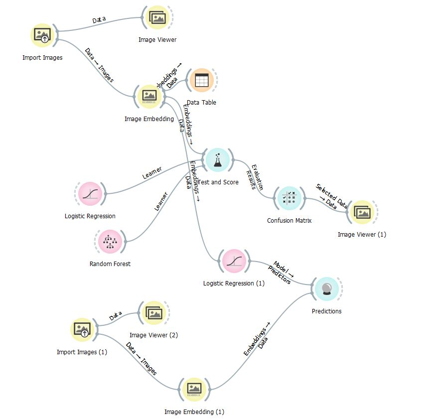

# Image-Classification-without-Coding
In this tutorial, I am going to share with you how you can use machine learning model to perform image classifications without using any programming at all. We are going to use Orange Data Mining tool for this example.

To download the dataset:
https://www.kaggle.com/alxmamaev/flowers-recognition#

Youtube video:
https://youtu.be/j9iEd-SBmoc

